<div align="center">

<picture>
  <source media="(prefers-color-scheme: dark)" srcset="docs/brand/lyna-mark-dark.png">
  
</picture>

# LYNA TMUX

**A ready-made Claude Code workspace on tmux.**

Styled split layouts, live agent state in the status bar, an agent picker, a side-by-side diff
review and a sandbox configured per launch. No tmux commands to learn, and your own tmux and
Claude Code settings are never touched. The command is `lmux`.

[](https://github.com/bayoudhdev/lyna-claude-tmux/actions/workflows/ci.yml)
[](https://github.com/bayoudhdev/lyna-claude-tmux/releases)
[](go.mod)
[](LICENSE)
[](https://www.lyna-it.com/)

</div>

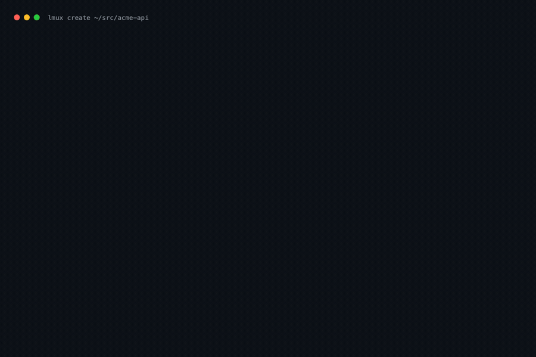

```bash
lmux create ~/src/acme-api
```

That one command opens the project in its own tmux server: Claude Code on the left, a shell and a
live changes pane on the right, a status bar that shows what every agent is doing, and a sandbox
that keeps your credentials out of reach of the tools Claude runs.

Every picture and animation on this page is a real terminal, recorded from the scenes in
[docs/scenes](docs/scenes) by `scripts/record.sh`. Nothing is mocked up, and every screen is in the
[gallery](docs/gallery.md).

## Why

tmux is the right place for an agent that runs for minutes at a time: it survives a closed terminal,
it splits a screen, and it can hold several projects at once. It is also hostile to newcomers, and
Claude Code has depth (sandboxing, worktrees, background agents, teams, hooks, status line) that
most people never configure.

lyna-tmux does both halves for you:

- **A workspace, not a terminal multiplexer.** Mouse first, no prefix key needed, clickable status
  bar buttons, right-click menus, readable panes with role labels.
- **Claude Code set up per launch.** A generated settings file (never your own) turns on the
  sandbox, the hooks that report agent state, the status line, truecolor, teams and worktrees.
- **Its own tmux server.** `~/.tmux.conf` is never read or written; your running sessions are not
  touched. Uninstall removes exactly what lyna-tmux wrote.

## Install

```bash
# With Go
go install github.com/bayoudhdev/lyna-claude-tmux/cmd/lmux@latest

# Or the release binary (checksum verified, installs into ~/.local/bin, no sudo)
curl -fsSL https://raw.githubusercontent.com/bayoudhdev/lyna-claude-tmux/main/scripts/install.sh | sh
```

Packages (`.deb`, `.rpm`, `.apk`) and archives for macOS and Linux, amd64 and arm64, are attached to
every [release](https://github.com/bayoudhdev/lyna-claude-tmux/releases), with checksums, an SBOM
and a build provenance attestation.

Requirements: tmux 3.3 or newer, Claude Code 2.1.257 or newer, git. `lmux doctor` checks all of
it and prints the exact command that fixes anything missing. Windows is supported through WSL2.

## Quickstart

```bash
lmux setup                 # optional: theme, layout, sandbox and model defaults
lmux create ~/src/acme-api # open the workspace (attaches if it is already open)
lmux                       # the dashboard: workspaces, agents, quick actions
```

## Panes

`Alt+\` splits right, `Alt+-` splits down, `Alt+z` zooms the pane you are in and `Alt+x` closes it
after asking. Every pane border says what the pane is for.

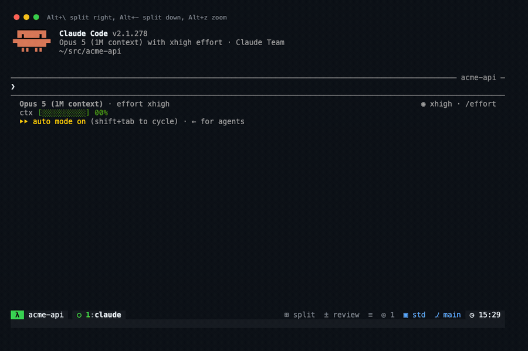

`Alt+]` and `Alt+[` move the focus, `Alt+Shift+arrows` resize, and `Alt+c` goes back to Claude from
wherever you are.

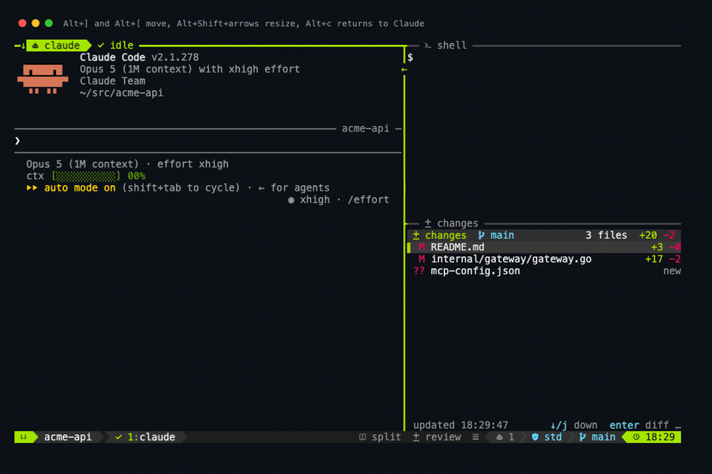

## Windows

`Alt+n` opens a window, `Alt+1` to `Alt+9` switch to one, and `Alt+e` opens the tree of every
workspace and window on the server. The tab of each window carries a dot with the state of the
agent in it: amber while it works, red when it waits for you, green when it is idle.

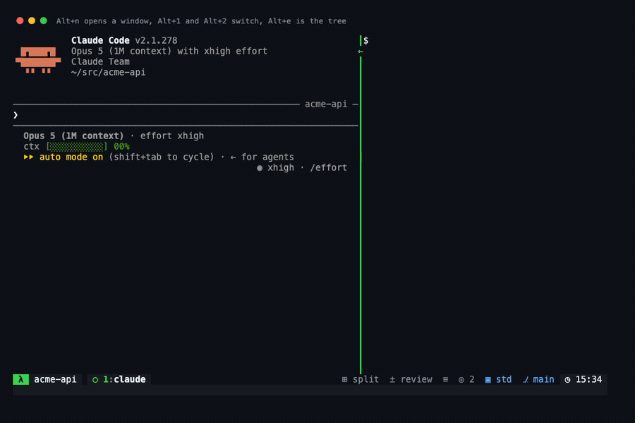

## Every action in one menu

`Alt+Space` opens the menu: every action with its key, grouped, so nothing has to be remembered.
Right-clicking a pane, a window tab or the session name opens the menu for that thing instead.

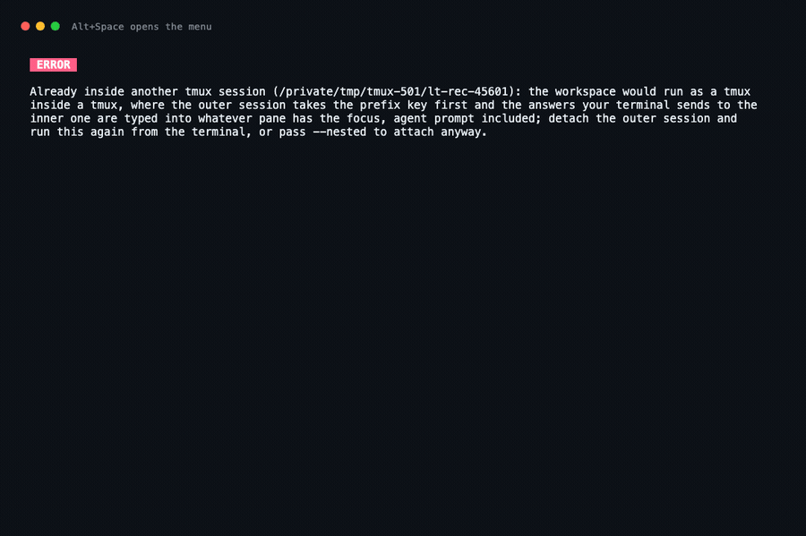

| Action | Mouse | Key |
|---|---|---|
| Split right, split down | `split` in the status bar, or right-click a pane | `Alt+\`, `Alt+-` |
| Review the diff | `review` in the status bar | `Alt+g` |
| Agent picker | the agents block in the status bar | `Alt+a` |
| Scratch shell | the menu | `Alt+s` |
| Everything else | the menu glyph, or right-click | `Alt+Space` |

Keys use Alt (Option on macOS) and never collide with the keys Claude Code reserves. `lyna-tmux
keys` prints both maps side by side, and [docs/keys.md](docs/keys.md) explains how to enable Option
as Meta in your terminal.


## Reviewing what the agent changed

`Alt+g` opens the working tree in a side-by-side diff, file list on the left, with the editor
bindings you already know. It closes back into the workspace.


The live changes pane of the `trio` layout keeps the same list in view while the agent works, file
by file, with the lines added and removed. Move through it with the arrows, `j` and `k` or the
wheel, press Enter or double click a file to review that file alone, and `o` to review the whole
working tree. Both open over the pane and close back into it.


## The git workstation

`Alt+G` opens the repository in one pane: the branches, the worktrees and the stashes on the left,
the history with its lanes in the middle, the commit or the working tree on the right. Every
operation is a key on whatever the cursor is on: stage and commit, branch, merge, rebase, cherry
pick, stash, tag, reword, drop and fold commits, fetch, pull and push.

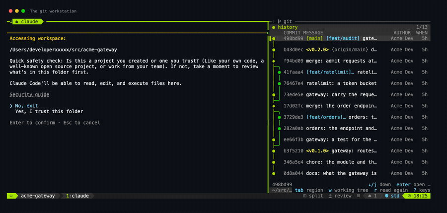

Anything that cannot be undone asks first, and shows the exact command it is about to run. The
command is built by the same code that runs it, so what you agree to is what happens. A rebase that
stops on a conflict becomes a banner offering to carry on, leave that commit out or put the branch
back. The full key map is in [docs/git.md](docs/git.md).

## The agent picker

`Alt+a` lists every Claude agent on the machine: the ones in this workspace, the ones in another
terminal, and background jobs. Enter jumps to the pane of an agent or attaches a background job,
`ctrl+x` stops one after checking the process really is that agent.

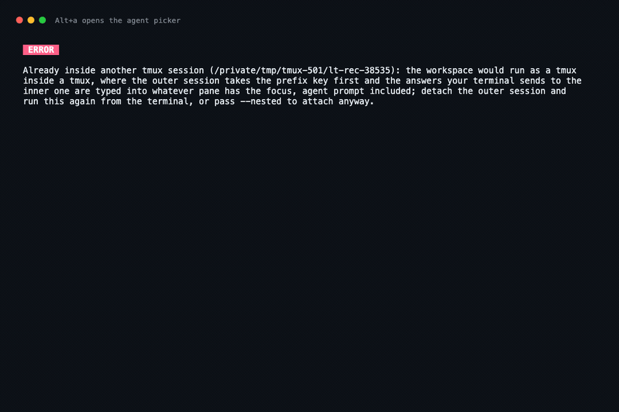

## A shell without leaving the workspace

`Alt+s` opens a shell in a popup over the panes, in the project directory. It disappears when it
exits, and the workspace underneath is untouched.

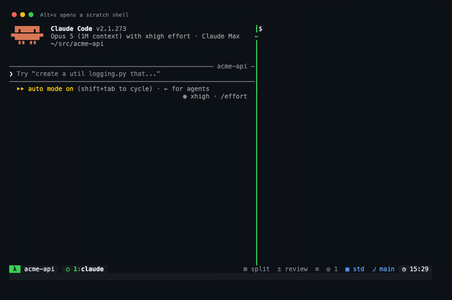

## Layouts

| Layout | Panes |
|---|---|
| `solo` | Claude |
| `duo` | Claude and a shell |
| `trio` | Claude, a shell and a live changes pane |
| `quad` | four Claude agents, each in its own git worktree |
| `review` | Claude and the side-by-side diff |
| `team` | the agents rail, the lead and room for its teammates |
| `git` | Claude and the git workstation |
| `auto` | picks one from the size of the terminal |

`lmux layout <name>` opens one in a new window, `lmux split right` adds a pane to the
current one, and custom layouts go in the configuration file, pane by pane.

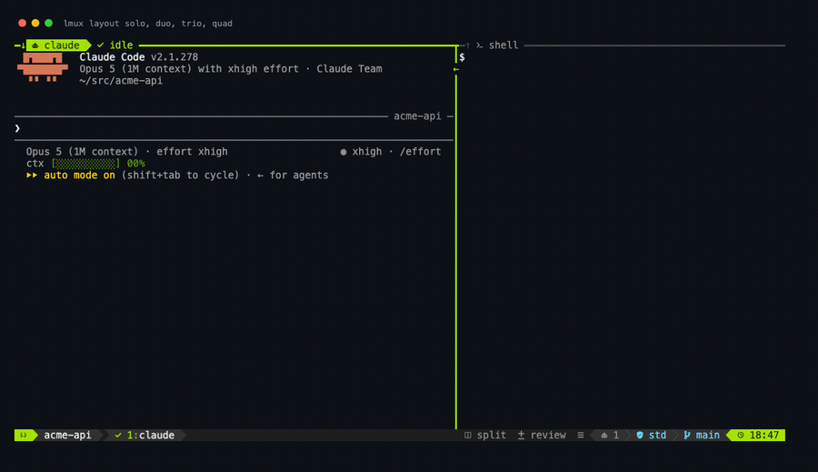

## Tasks, worktrees and resuming

```bash
lmux task rate-limit "add a token bucket to the API gateway"  # a window in its own worktree
lmux resume                                                   # pick a past conversation
```

Each `task` gets its own git worktree, so agents never fight over the same files, and running one
again by the same name selects the window it already has.

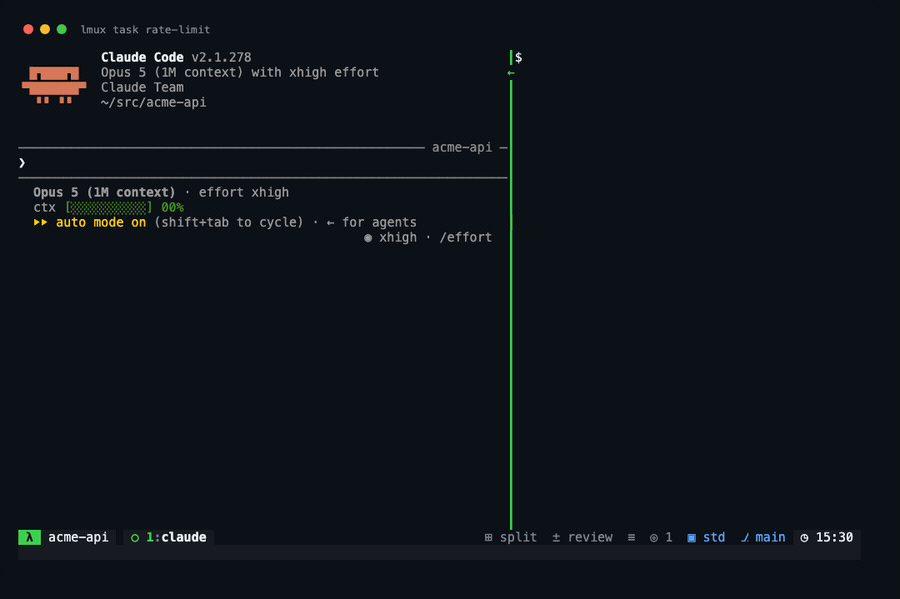

`lmux resume` picks a past conversation and continues it in the workspace.

## Agent teams

`lmux team` opens a workspace with agent teams turned on, in a layout built for one: the agents
rail on the left, the lead beside it, and the room its teammates open into.

Every teammate the lead starts becomes a pane of the workspace. It carries its own name on the
border, the state its hooks report, and a place chosen by the workspace rather than by whatever
opened it: beside the lead while the window is the lead's alone and the panes stay readable, in a
window of its own after that. If anything at all goes wrong taking a pane over, the agent runs
where it was opened and the team is unaffected; `lmux doctor` then says which teammate fell back
and why.

The rail lists every agent the workspace can see: the lead, its teammates, the subagents they run,
and the agents of the other workspaces on the server. `enter` focuses one, `z` zooms it, `w` gives
it a window of its own, `/` filters, and `s` starts a new agent. It opens with the first teammate
and closes with the last, or on `Alt+A`.

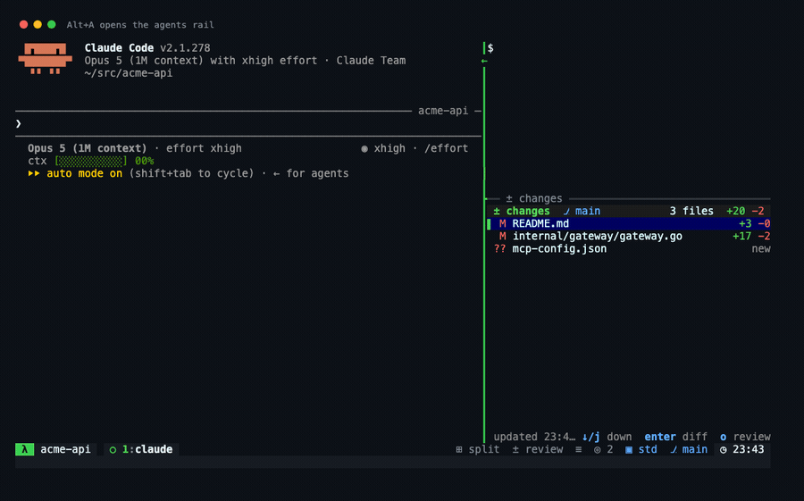

The team is steered from there rather than by typing at the lead: `m` sends a message to one agent
after showing the exact text it will type, `x` stops a teammate through its lead or, once you have
typed its name out, by closing its pane, `r` reads what an agent is writing, subagents included,
and `t` shows the shared task list with what each task is waiting on. The footer counts the list
and what the agents have spent between them. Each is a command of its own as well:
`lmux message`, `lmux stop`, `lmux transcript` and `lmux tasks`.

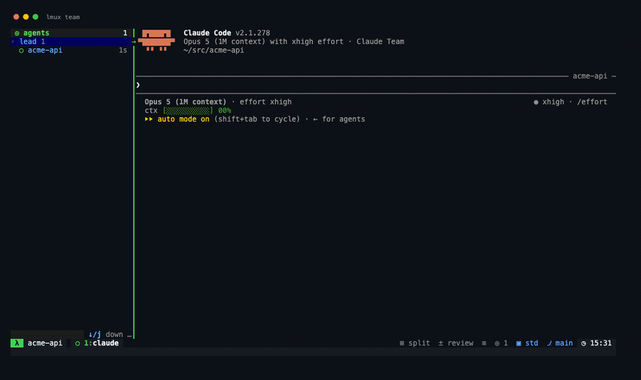

`lmux spawn`, the same form as `s`, asks for an agent: which definition it runs, on which model and
effort, in the project directory or a git worktree of its own. It either asks the lead, typing the
exact sentence it just showed you, or opens a session of its own in a new window.

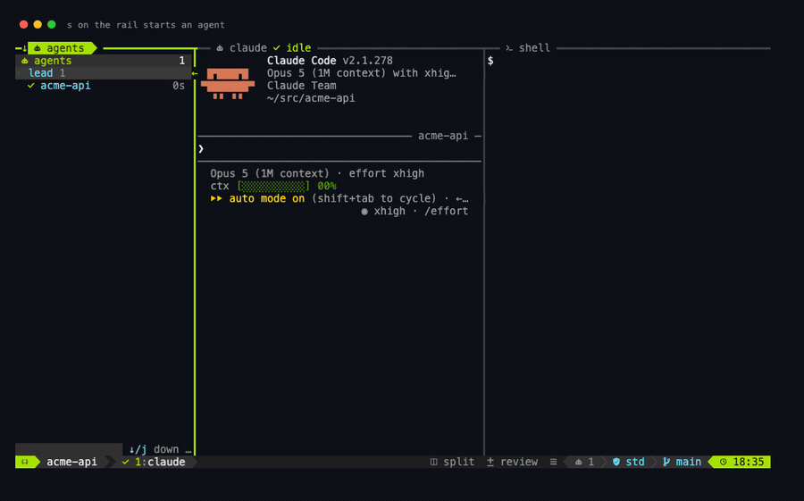

[docs/agents.md](docs/agents.md) has the whole picture, every key and every setting.

## The dashboard

`lmux` with no command opens the dashboard: every workspace with its layout, sandbox and
project, every agent underneath, and one key per action.

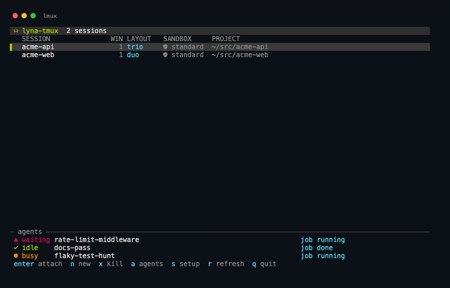

Workspaces are managed from the command line too.

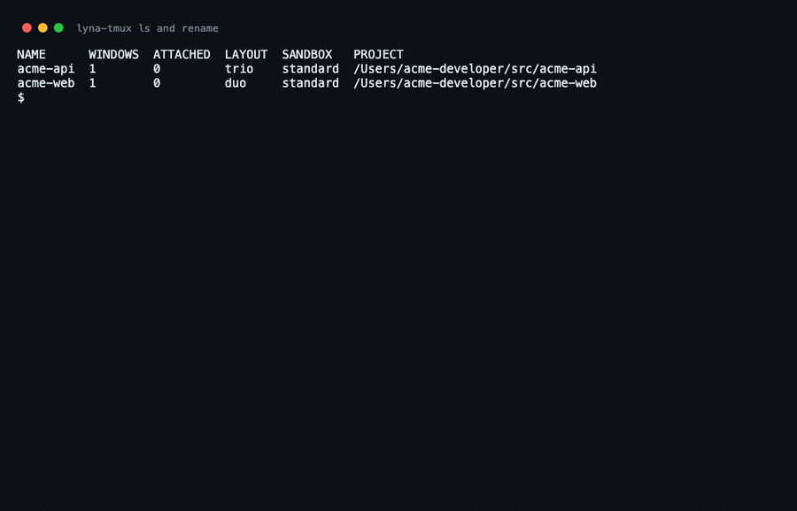

## Sandbox

Claude Code runs commands for you. The sandbox decides what those commands can read, write and
reach, and lyna-tmux sets it per launch instead of leaving it to a global file.

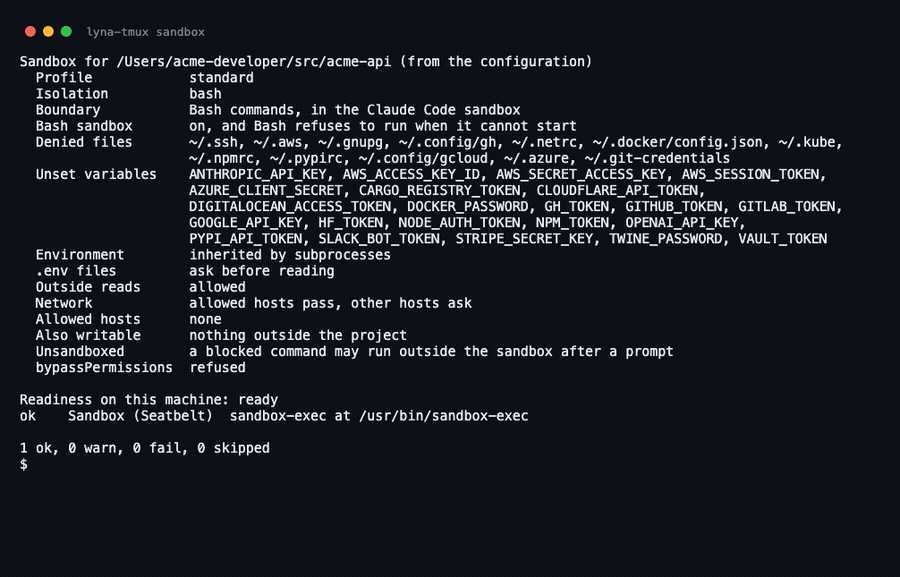

| Profile | What it does |
|---|---|
| `standard` (default) | Bash runs sandboxed and refuses to run unsandboxed; credential files and token variables are out of reach; `.env` reads ask first |
| `strict` | Also: no unsandboxed fallback, network limited to an allowlist built from the project's own ecosystems, reads confined to the working directories, credentials scrubbed from every subprocess |
| `off` | No sandbox. Only with an explicit `--sandbox off`, and the status bar turns red |

Isolation goes further than the Bash tool when you want it: `--isolation process` wraps the whole
Claude process in the sandbox runtime, and `--isolation container` runs the entire workspace inside
a dev container with a default-deny egress firewall, a non-root user and no Docker socket.
`bypassPermissions` is refused unless the profile is `strict` or the workspace runs in a container.

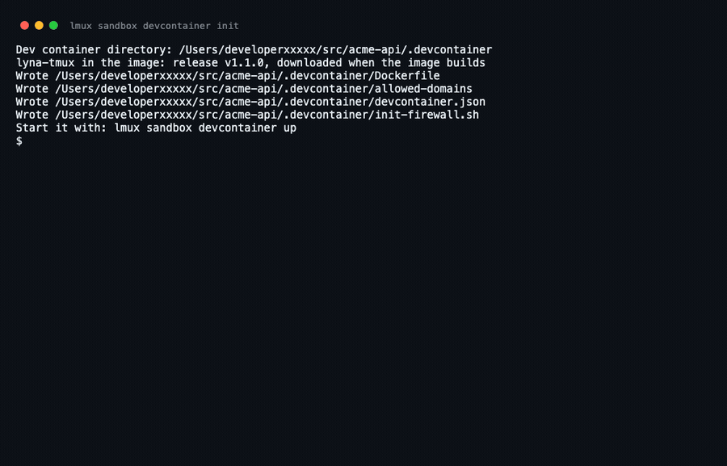

Full reference, including what each profile does not protect: [docs/sandbox.md](docs/sandbox.md).

## Configuration

```bash
lmux config init   # write the documented file
lmux config edit   # open it in $EDITOR
lmux config validate
```

Everything is optional and every key is documented in the file itself: theme and icons, default
layout and split ratio, prefix key, Claude model, effort and permission mode, sandbox profile and
isolation, extra allowed hosts, review editor, popup size, custom layouts. The full reference is
[docs/configuration.md](docs/configuration.md).

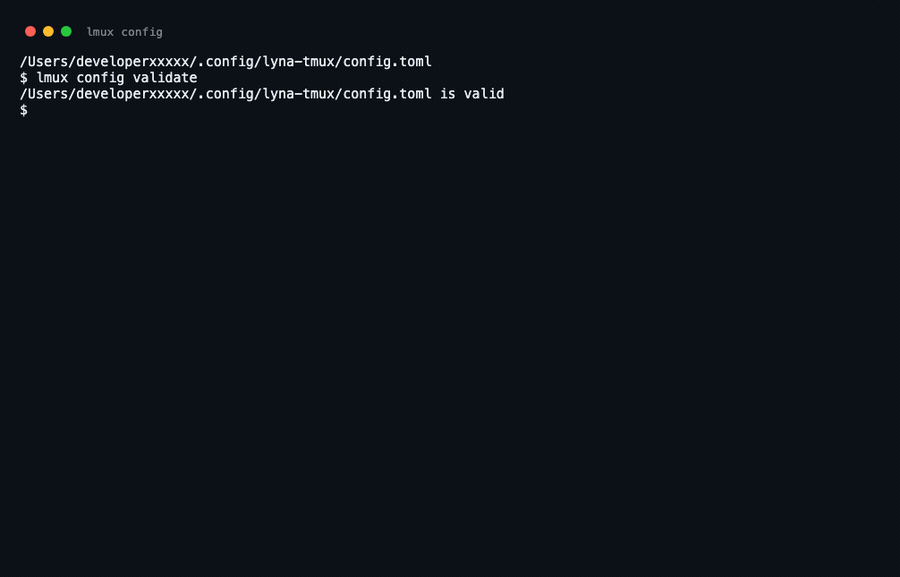

`lmux setup` writes the same file through a wizard.

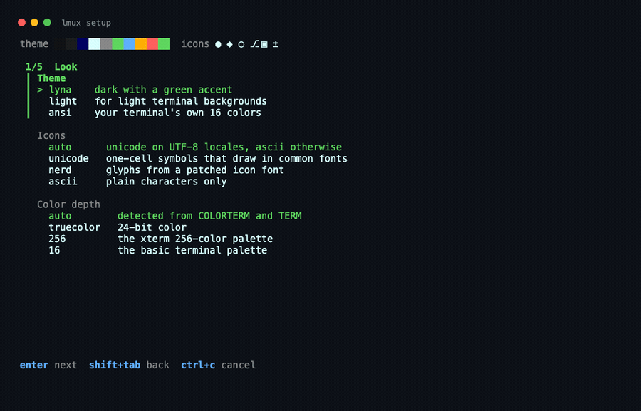

Thirteen themes ship with it, nine dark, three light and one that borrows the terminal's own
palette. `lmux theme` lists them with a swatch each, `lmux theme preview [name]` draws a
whole workspace in one so you can pick before you switch, and `lmux theme <name>` restyles
every running workspace at once. Themes quantize to 256 or 16 colors when the terminal has no
truecolor, and the icon set falls back to ASCII outside a UTF-8 locale.


## Using your own tmux

If you already have a tmux setup, keep it. Plugin mode adds two bindings to your own server without
a second one:

```tmux
set -g @plugin 'bayoudhdev/lyna-claude-tmux'
```

`prefix + y` opens a Claude popup for the current directory, `prefix + u` opens the agent picker.


The Claude Code plugin ships the same hooks for sessions you start yourself:

```
/plugin marketplace add bayoudhdev/lyna-claude-tmux
/plugin install lyna-tmux@lyna-tmux
```

## Checking the machine

`lmux doctor` checks tmux, Claude Code, how agent teams open, git, the sandbox, the terminal and
the review editor, and prints the command that fixes anything it finds.


`lmux doctor --fix` goes one step further: it offers, one at a time, the fixes lyna-tmux can
carry out itself, such as installing the review plugin or updating Claude Code, and answers `y`,
`n`, `a` for all or `q` to stop. `--yes` applies them all without asking and `--dry-run` only shows
them. Everything else stays yours to do and is listed at the end: a terminal setting, an account,
a package manager that asks for a password. It never edits `~/.tmux.conf` or your Claude Code
settings.

## Performance

Hooks and the status line run many times per turn, so they are a single static binary that starts
and exits. Measured with hyperfine on an Apple M-series laptop, against a Go hello world as the
floor:

| Command | Mean | Floor (hello world) |
|---|---|---|
| `lmux version` | 6.4 ms | 2.6 ms |
| `lmux hook Stop` | 6.4 ms | 2.6 ms |
| `lmux statusline` | 6.7 ms | 2.6 ms |

Under 4 ms of work each on top of what starting any process on that machine costs, and hooks run
with `async: true`, so a Claude turn never waits for one. The full table, with the machine and the
spread, is in [docs/benchmarks.md](docs/benchmarks.md); regenerate it on your own machine with
`make bench`.

## Security

The threat model, and what lyna-tmux does about each item, is in [SECURITY.md](SECURITY.md). In
short: every tmux call is argv, never a shell string; names and paths that reach tmux are validated
and escaped; terminal escapes in previews are stripped; state is 0700 with 0600 files written
atomically; hooks read a bounded stdin, execute nothing from it and always exit 0; killing an agent
re-verifies the process first; a dev container is built, entered and used only from files that still
match what lyna-tmux wrote; and the sandbox cannot be turned off without saying so.

Found a vulnerability? Report it privately through GitHub security advisories, not in an issue.

## Troubleshooting

**The status bar shows no agent state.** Claude Code runs no hooks in a project you have not
trusted, and it asks about a new folder the first time it opens there. `lmux create` says so
when it opens such a project, and `lmux doctor` reports it as `Project trust`. Accept the
question Claude Code shows in the workspace, or start `claude` once in the project and accept it
there.

**Escape sequences appear in the agent prompt, and keys go to the wrong session.** You started the
workspace from a terminal that was already running tmux, so one tmux is attached inside another.
The outer session reads the prefix key first, and the answers your terminal sends the inner server
arrive too late to be recognized and are typed into whatever pane has the focus, which is how
`^[[?1;2;4c` or `^[P>|tmux 3.7c^[\` end up in the prompt. `lmux create` and `lmux attach`
refuse there and say so; detach the outer session first, or pass `--nested` to attach anyway.

**Alt keys do nothing.** Your terminal sends Option as a composed character. `lmux doctor`
names the setting for your terminal, and [docs/keys.md](docs/keys.md) lists them all.

**Colors look flat.** The terminal is not advertising truecolor. `lmux doctor` says what to
set; the themes quantize to 256 or 16 colors when they have to.

**Everything else.** `lmux doctor` prints a fix with every warning and failure.

## Uninstall

```bash
lmux uninstall          # stop the server, remove what lyna-tmux wrote
lmux uninstall --purge  # also remove the state, cache and configuration directories
```

It lists what it will remove before it removes anything.


## Contributing

Issues and pull requests are welcome. [CONTRIBUTING.md](CONTRIBUTING.md) has the development loop:
`make check` runs the linters, the unit and real-tmux integration tests, the fuzz targets and the
coverage floor. Every change comes with tests, and the documentation images are re-recorded with
`scripts/record-docs.sh`.

## License

MIT, Copyright (c) 2026 LYNA-IT. See [LICENSE](LICENSE). Third-party components keep their own
licenses, listed in [NOTICE](NOTICE).
